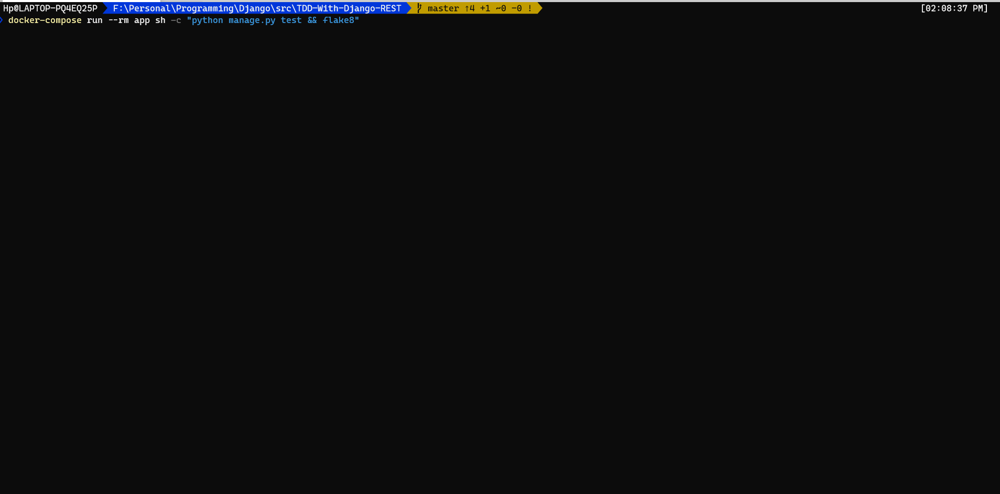
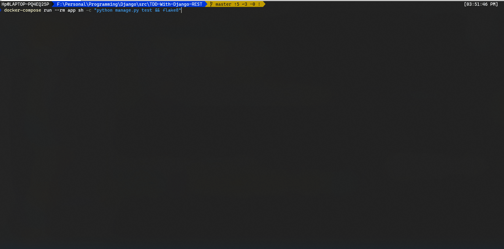

[![Build Status][build status badge]][build status link] [![Issue Status][issue status badge]][issue status link] [![License Status][license status badge]][license status link] [![Fork Status][fork status badge]][fork status link]

<!-- markdownlint-disable -->

<!-- markdownlint-enable -->

[build status badge]: https://travis-ci.com/DevDHera/TDD-With-Django-REST.svg?branch=master
[build status link]: https://travis-ci.com/github/DevDHera/TDD-With-Django-REST
[issue status badge]: https://img.shields.io/github/issues/DevDHera/TDD-With-Django-REST
[issue status link]: https://github.com/DevDHera/TDD-With-Django-REST/issues
[license status badge]: https://img.shields.io/github/license/DevDHera/TDD-With-Django-REST
[license status link]: https://github.com/DevDHera/TDD-With-Django-REST/blob/master/LICENSE
[fork status badge]: https://img.shields.io/github/forks/DevDHera/TDD-With-Django-REST
[fork status link]: https://github.com/DevDHera/TDD-With-Django-REST/network/members

# TDD-With-Django-REST 😎

This project is a guide to REST API development with the help of [Django Rest Framework](https://www.django-rest-framework.org/).

A [Test Driven Development ](https://hackernoon.com/introduction-to-test-driven-development-tdd-61a13bc92d92) approach is used to build out this project and API contains features such as,

- Fully fledged Authentication mechanisam
- Image Upload
- CRUD and relations

and much more.

## Summary

- [Getting Started](#getting-started)
- [Runing the tests](#running-the-tests)
- [Deployment](#deployment)
- [Built With](#built-with)
- [Contributing](#contributing)
- [Authors](#authors)
- [License](#license)
- [Acknowledgments](#acknowledgments)

## Getting Started

Getting started with the `TDD-With-Django-REST` is easy.

1. First clone the project.

```sh
git clone https://github.com/DevDHera/TDD-With-Django-REST.git
```

2. Start your docker machine.

3. Go to the root of your cloned project and build the docker image.

```sh
docker-compose build
```

4. Do the neccessary migrations.

```sh
docker-compose run --rm app sh -c "python manage.py makemigrations"
```

5. Run the app using `docker-compose`.

```sh
docker-compose up
```

5. Now head over to our [issue board](https://github.com/DevDHera/TDD-With-Django-REST/issues) and help solving issues 👼.

### Prerequisites

`TDD-With-Django-REST` uses **[Docker](https://www.docker.com/)** to manage containers.

In order to successfully run the project install the following.

- Docker

### Configurations

After installing the above you can provision services as you like using the `docker-compose.yml` file on the root of the project.

Following is the structure that we are using.

```yaml
version: '3'

services:
  app:
    restart: always
    build:
      context: .
    ports:
      - '8000:8000'
    volumes:
      - ./app:/app
    command: >
      sh -c "python manage.py wait_for_db &&
         python manage.py migrate &&
         python manage.py runserver 0.0.0.0:8000"
    environment:
      - DB_HOST=db
      - DB_NAME=app
      - DB_USER=postgres
      - DB_PASS=supersecretpassword
    depends_on:
      - db

  db:
    image: postgres:12-alpine
    environment:
      - POSTGRES_DB=app
      - POSTGRES_USER=postgres
      - POSTGRES_PASSWORD=supersecretpassword
```

## Running the tests

As the project uses a TDD approach test take a key role. Following describes how you can run the tests and lints.

### Break down into tests

Each app contains test folder that will is used to test each part of the API. You can run these tests by using the below script.

```sh
docker-compose run --rm app sh -c "python manage.py test"
```

### And coding style tests

[Flake8](https://flake8.pycqa.org/en/latest/) is used to enforce the coding styles. Lint command as belows.

```sh
docker-compose run --rm app sh -c "flake8"
```

You can run both the tests and lints in one go like below.

```sh
docker-compose run --rm app sh -c "python manage.py test && flake8"
```

### Test Look Through

#### Failing Test



#### Passing Test



## Deployment

To deploy the API first you can use the power of `docker-compose`.

Simply run the belwo.

```sh
docker-compose up
```

## Built With

- [Django](https://www.djangoproject.com/) - The web framework used
- [Django Rest Framework](https://www.django-rest-framework.org/) - Web API Framework
- [PostgreSQL](https://www.postgresql.org/) - DB Used
- [psycopg2](https://pypi.org/project/psycopg2/) - PostgreSQL database adapter
- [flake8](https://flake8.pycqa.org/en/latest/) - Linter
- [Docker](https://www.docker.com/) - Container Manager

## Contributing

Please read [CODE_OF_CONDUCT.md](https://github.com/DevDHera/TDD-With-Django-REST/blob/master/CODE_OF_CONDUCT.md) for details on our code of conduct, and the process for submitting pull requests to us.

## Authors

- **Devin Herath** - _Initial work_ - [DevDHera](https://github.com/DevDHera)

See also the list of [contributors](https://github.com/DevDHera/TDD-With-Django-REST/graphs/contributors) who participated in this project.

## License

This project is licensed under the MIT License - see the [LICENSE](https://github.com/DevDHera/TDD-With-Django-REST/blob/master/LICENSE) file for details.

## Acknowledgments

- [PurpleBooth](https://github.com/PurpleBooth) for this awesome README template :heart:
